# CST8915 - Assignment 2

## Updated Application Architecture

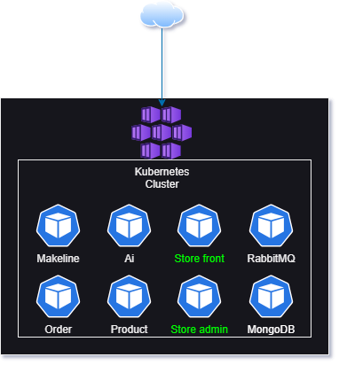

How these pods interact with each other:

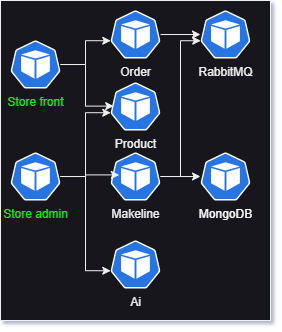

## Application and Architecture Explanation

The application is run completely in containers, including RabbitMQ.

The Store front and Store admin both have external IP addresses exposed through Kubernetes via the `type: LoadBalancer` option in the `aps-all-in-one.yaml` file included in this repository.

## Deployment Instructions

1. For initial deployment, 3 files are needed:

- `aps-all-in-one.yaml`
- `config-maps.yaml`
- `secrets.yaml`

2. Using the portal, create the Kubernetes cluster:

- Basics
    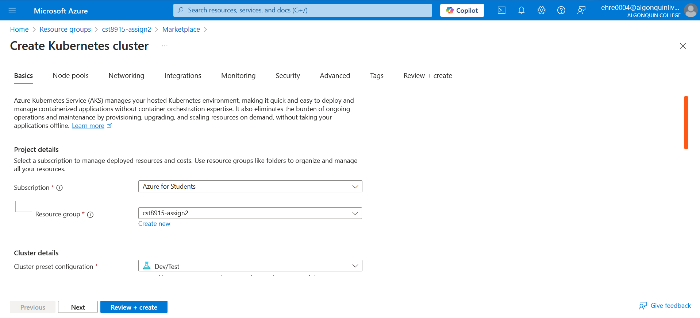
    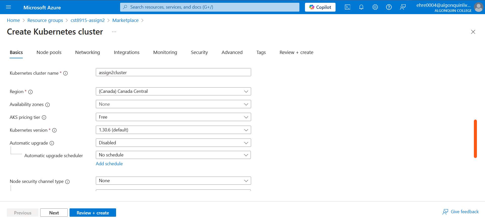
    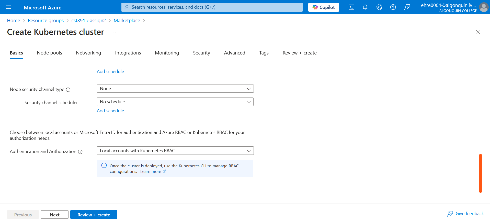
- Node pools
    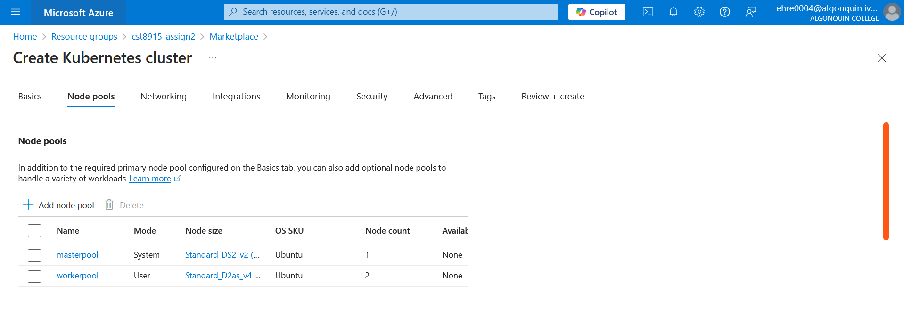
    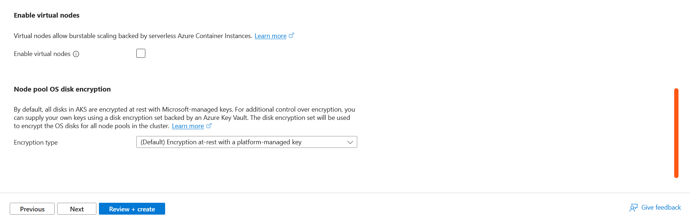
- Node pools: masterpool
    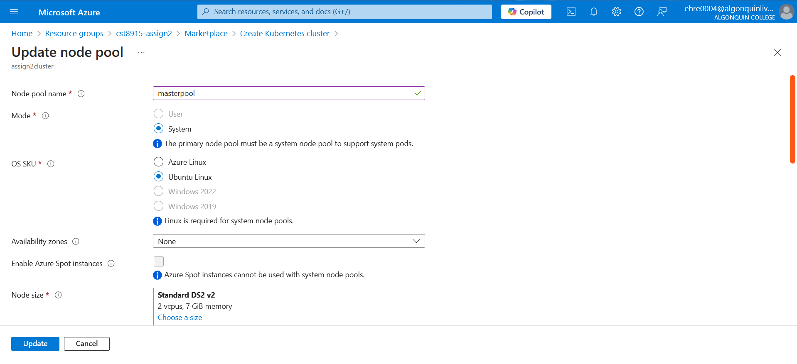
    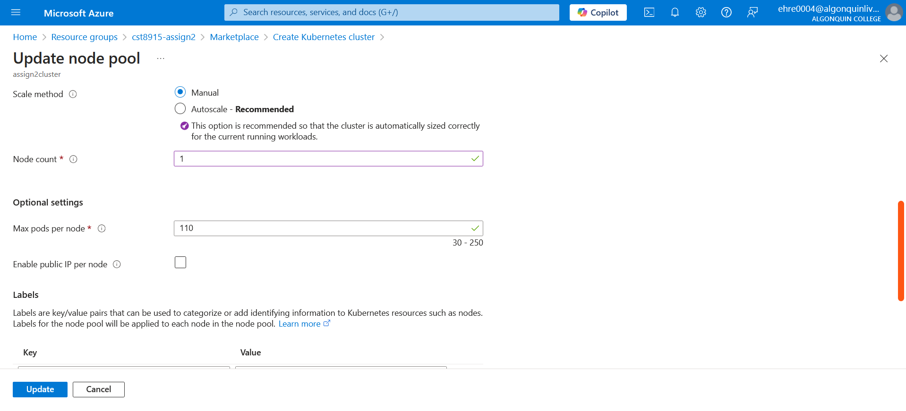
- Node pools: workerpool
    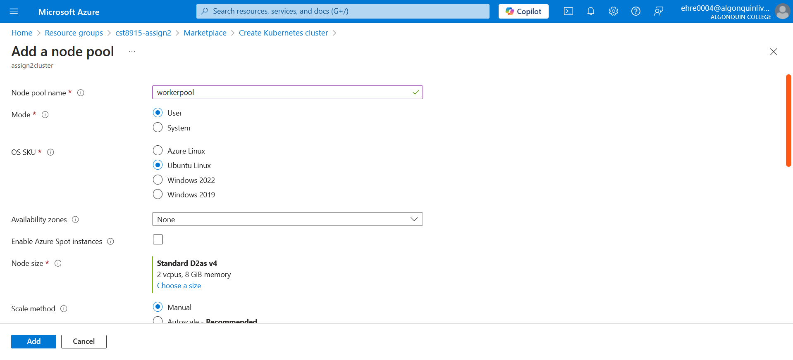
    

3. Using the portal, create OpenAI resource:

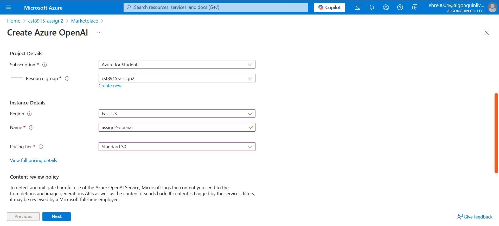
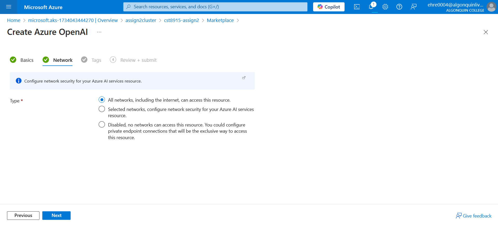

4. Open the created OpenAI resource, and select open in Azure AI Foundry. Create a deployment for name `gpt-4` and `dall-e-3`. On the home screen, copy the `API key` (1) and the `Azure OpenAI Endpoint` for later.
5. Access the cluster from Azure CLI by navigating to the cluster in the resource group, e.g. `assign2cluster`.

    ```console
    az login
    az account set --subscription <subscription-id>
    az aks get-credentials --resource-group cst8915-assign2 --name assign2cluster --overwrite-existing
    ```

6. Run the following commands:

    ```console
    kubectl apply -f secrets.yaml
    kubectl apply -f config-maps.yaml
    kubectl apply -f aps-all-in-one.yaml
    ```

7. Check the status of the pods for full readiness:

    ```console
    kubectl get pods
    ```

8. Once the pods are 1/1 for readiness, check services for the external IP of `store-admin` and `store-front`:

    ```console
    kubectl get services
    ```

    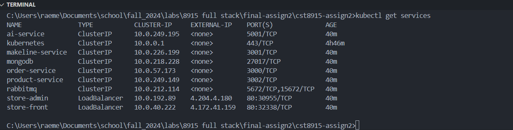

9. Go to the external IP in a browser for both `store-front` and `store-admin` to use the application.

## Table of Microservice Repositories

| Service          | Repository Link                                                        |
| ---------------- | ---------------------------------------------------------------------- |
| Ai-Service       | [ai-service-L8](https://github.com/ehre0004/ai-service-L8)             |
| Makeline-Service | [makeline-service-L8](https://github.com/ehre0004/makeline-service-L8) |
| Order-Service    | [order-service-L8](https://github.com/ehre0004/order-service-L8)       |
| Product-Service  | [product-service-L8](https://github.com/ehre0004/product-service-L8)   |
| Store-Admin      | [store-admin-L8](https://github.com/ehre0004/store-admin-L8)           |
| Store-Front      | [store-front-L8](https://github.com/ehre0004/store-front-L8)           |

## Table of Docker Images

Here is a table of the docker images for services I created:

| Service          | Docker Image Link                                                                                     |
| ---------------- | ----------------------------------------------------------------------------------------------------- |
| Ai-Service       | [rmaehret/assign2-ai](https://hub.docker.com/repository/docker/rmaehret/assign2-ai)                   |
| Makeline-Service | [rmaehret/assign2-makeline](https://hub.docker.com/repository/docker/rmaehret/assign2-makeline)       |
| Order-Service    | [rmaehret/assign2-order](https://hub.docker.com/repository/docker/rmaehret/assign2-order)             |
| Product-Service  | [rmaehret/assign2-product](https://hub.docker.com/repository/docker/rmaehret/assign2-product)         |
| Store-Admin      | [rmaehret/assign2-store-admin](https://hub.docker.com/repository/docker/rmaehret/assign2-store-admin) |
| Store-Front      | [rmaehret/assign2-store-front](https://hub.docker.com/repository/docker/rmaehret/assign2-store-front) |

## Any issues or limitations in the implementation

The obvious issue of not using Service bus instead of RabbitMQ limits us in capability. RabbitMQ is not exposed via the typing `LoadBalancer`, so accessing its native GUI is impossible without changing the deployment.

Furthermore, issues surrounding Azure OpenAI causes a 401 (forbidden) error, likely due to the API key. While the key is coded via Base64 (`echo <key> | base64 -w 0`), it does not succeed in AI-generated text and images. This may be caused by the deployment settings of Azure OpenAI. Because I was unable to create an instance in East US, I attempted multiple times to deploy, but was unsuccessful.

## Demo Video

[](https://www.youtube.com/watch?v=FCNjtUxd3gY)